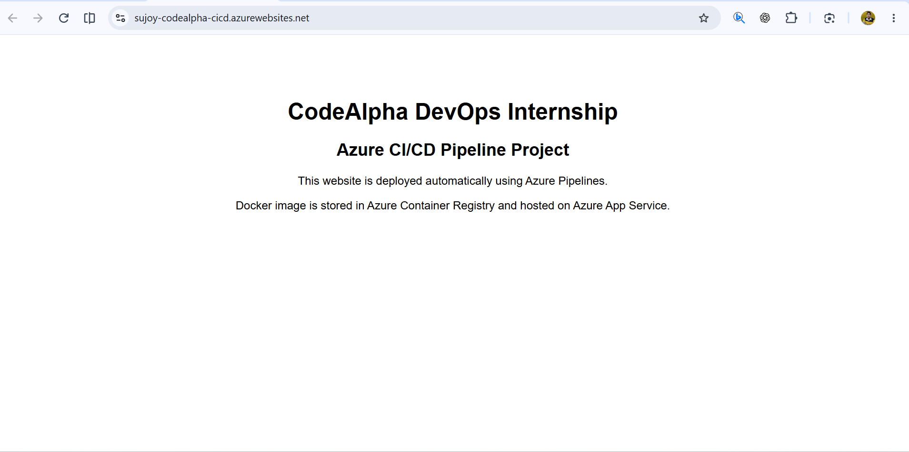
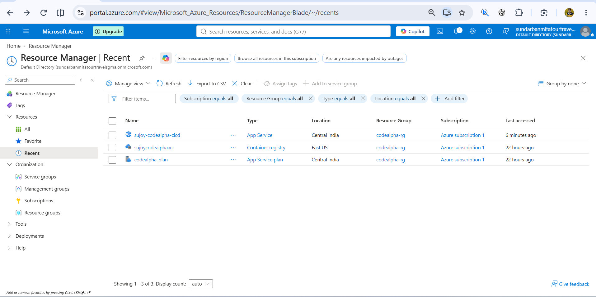
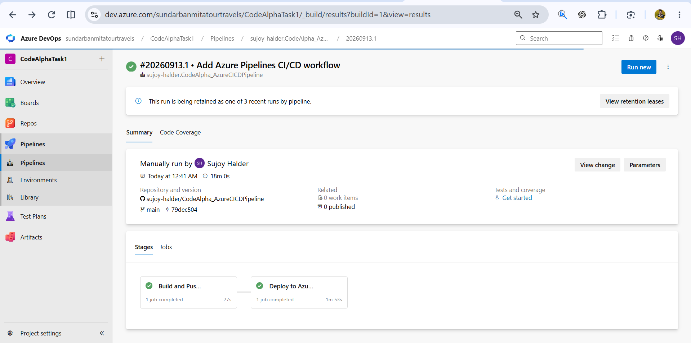
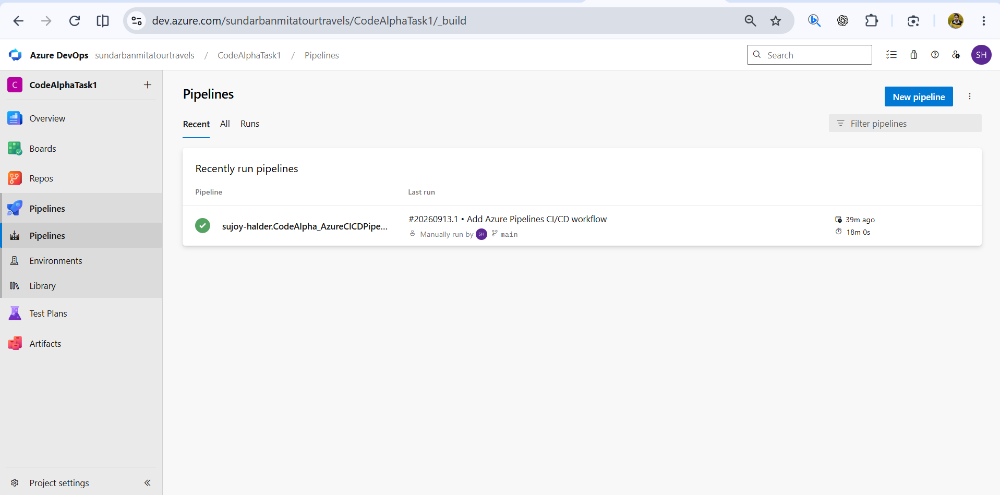
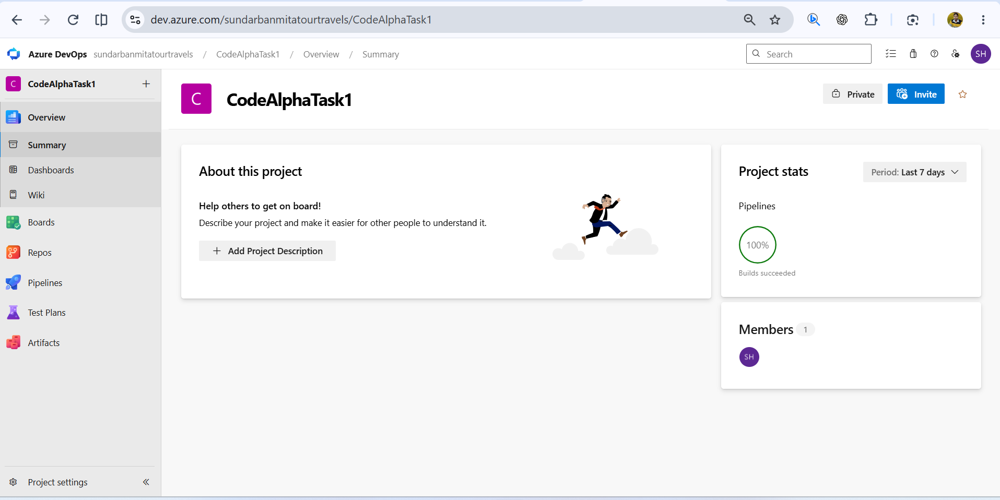

# CodeAlpha DevOps Task 1 - Azure CI/CD Pipeline

This repository contains my CodeAlpha DevOps Internship Task 1 project: an automated CI/CD pipeline using Azure DevOps, Docker, Azure Container Registry, and Azure App Service.

## Project Overview

The project demonstrates how a containerized web application can be built, pushed, and deployed automatically whenever code is updated in GitHub.

On every push to the `main` branch, Azure Pipelines builds a Docker image from the application source code, pushes the image to Azure Container Registry, and deploys the container to Azure App Service.

## Live Application

Application URL:

```text
https://sujoy-codealpha-cicd.azurewebsites.net
```

Note: The Azure Web App may be stopped after project verification to avoid unnecessary cloud charges.

## Repository

```text
https://github.com/sujoy-halder/CodeAlpha_AzureCICDPipeline
```

## Architecture

```text
GitHub Repository
      |
      v
Azure Pipelines
      |
      v
Docker Build
      |
      v
Azure Container Registry
      |
      v
Azure App Service
      |
      v
Live Web Application
```

## Tools And Services Used

- GitHub
- Git
- Docker
- Nginx
- Azure CLI
- Azure DevOps
- Azure Pipelines
- Azure Container Registry
- Azure App Service
- Azure App Service Plan

## Project Structure

```text
CodeAlpha_AzureCICDPipeline/
  Dockerfile
  azure-pipelines.yml
  README.md
  site/
    index.html
  screenshots/
    1.png
    2.png
    3.png
    4.png
    5.png
```

## Dockerfile

```dockerfile
FROM nginx:alpine
COPY ./site /usr/share/nginx/html
EXPOSE 80
```

The Dockerfile uses the lightweight `nginx:alpine` image, copies the website files into the Nginx web root, and exposes port `80` for web traffic.

## CI/CD Pipeline

The pipeline is defined in `azure-pipelines.yml` and contains two stages:

1. **Build and Push Docker Image**
   - Builds the Docker image from the repository source code.
   - Tags the image with the Azure DevOps build ID and `latest`.
   - Pushes the image to Azure Container Registry.

2. **Deploy to Azure App Service**
   - Pulls the Docker image from Azure Container Registry.
   - Deploys the container to Azure App Service.
   - Updates the live web application automatically.

## Local Docker Run

Build the Docker image locally:

```bash
docker build -t codealpha-azure-app .
```

Run the container locally:

```bash
docker run -d --name codealpha-azure-container -p 8080:80 codealpha-azure-app
```

Open in browser:

```text
http://localhost:8080
```

Stop the local container:

```bash
docker stop codealpha-azure-container
docker rm codealpha-azure-container
```

## Azure Resources Created

- Resource Group: `codealpha-rg`
- Azure Container Registry: `sujoycodealphaacr`
- App Service Plan: `codealpha-plan`
- Azure Web App: `sujoy-codealpha-cicd`

## Output Screenshots

### Live Web Application



### Azure Resources



### Azure DevOps Pipeline Success



### Pipeline Overview



### Azure DevOps Project Summary



## Learning Outcome

Through this project, I learned how to:

- Create and test a Dockerized web application.
- Push source code to GitHub.
- Create an Azure Container Registry.
- Create and configure Azure App Service.
- Build an Azure DevOps pipeline using YAML.
- Configure Azure DevOps service connections.
- Automate Docker image build and deployment.
- Verify deployment using Azure DevOps pipeline logs and a live web application URL.

## Internship Task Completion

This project was completed as part of the CodeAlpha DevOps Internship.

Task 1 requirements covered:

- Automated CI/CD pipeline with Azure Pipelines.
- Azure Container Registry for container image storage.
- Automatic deployment to Azure App Service.
- Pipeline execution monitoring through Azure DevOps.
- Practical understanding of Docker, Azure, and CI/CD concepts.
